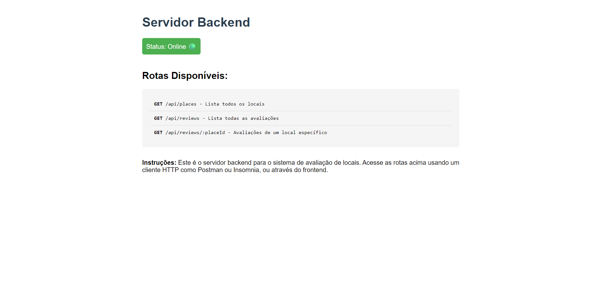

# avaliacao-locais

## inicie o Servidor Backend:

...\avaliacao-locais> cd backend

...\avaliacao-locais\backend> node server.js

aparecera:

Servidor backend rodando em http://localhost:5000

em http://localhost:5000 voce tera tambem um manual de acesso as rotas
  

## Para ver junto com o frontend:

abra o arquivo index.html
(...\avaliacao-locais\frontend\public\index.html)
